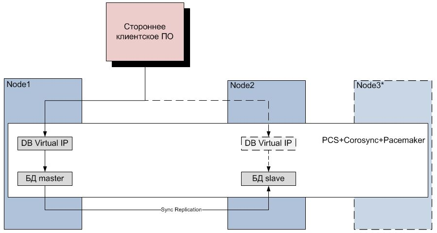

# Установка PostgreSQL/Pro в режиме standalone/cluster(pcs+corosync+pacemaker)

Роль для настройки СУБД PostgreSQL в standalone/cluster(pcs+corosync+pacemaker)     

Протестировано на ОС:    
CentOS: 7.9    
RedOS: 7.3   

Протестировано на СУБД:    
PostgreSQL: 11,12,13,14,15    
PostgresProEE: 11,12,13,14    

Ansible:  2.13.5

## Схема кластера


## Подготовка серверов   
Для запуска данного сценария необходимо:    

- Убедится, что есть сетевой доступ с управляющего сервера до управляемых узлов по 22 порту (ssh)    
- Убедится, что сетевой интерфейс настроен.
- Убедится, что учетная запись с правами администратора из под которой будет производится подключение создана      
- Убедится, что подключены репозитории postgres, os.    
- Убедится, что ip адреса настроены    
- Убедится, что hostname настроены верно    
- Убедится, что firewalld, nftables или iptables настроен (tcp: 5432, 2224 / udp: 5404, 5405).

## Требуемые коллекции
- Добавить коллекции в ansible:
    ```
    community.general
    ansible.utils
    ansible.netcommon
    community.postgresql
    ansible.posix
    ansible.netcommon
    ```

## Установка через ansible      

- Заполнить файл inventory.ini    
**Пример:**
   ```
   [master_server]     
   pg2 ansible_ssh_host=192.168.0.2 ansible_user=root ansible_become=yes     
   
   [slave_servers]     
   pg3 ansible_ssh_host=192.168.0.3 ansible_user=root ansible_become=yes    
   pg1 ansible_ssh_host=192.168.0.4 ansible_user=root ansible_become=yes    
   
   [quorum_servers]    
   pg4 ansible_ssh_host=192.168.0.5 ansible_user=root ansible_become=yes    
   pg5 ansible_ssh_host=192.168.0.6 ansible_user=root ansible_become=yes    

   [all:vars]
   # Parameters
   ```

- Заполнить /roles/asu-service.postgres.installation/defaults/main.yml

**Набор минимальных параметров для standalone**

**Parameter Host Group**   | **Type**| **Default values**       |           **INFO**
--------------------------|---------|--------------------------|-----------------------------------------------------------------
POSTGRES_VENDOR           | string  | postgresql               | Postgres vendor value "postgresql" or "postgrespro"                      
POSTGRES_VERSION          | integer | 14                       | Minimal postgres version value "11"                  

**Набор минимальных параметров для cluster**

**Parameter Host Group**   | **Type**| **Default values**       |             **INFO**
--------------------------|---------|--------------------------|-----------------------------------------------------------------
POSTGRES_VENDOR           | string  | postgresql               | Postgres vendor value "postgresql" or "postgrespro"                      
POSTGRES_VERSION          | integer | 14                       | Minimal postgres version value "11"                 
VIRTUAL_IP                | string  | -                        | Cluster virtual IP. e.g. 192.168.0.4                               


- Запустить ansible сценарий командой 
    ``` 
    ansible-playbook -i inventory.ini main-ansible.yml --ask-pass    
    ```

## Установка через Satellite

- Добавить в группу требуемые хосты    
- Заполнить глобальные параметры host group 
- Добавить роли в параметры серверов role_server

**Набор минимальных параметров для standalone**

|**Parameter Host**        | **Type**| **Default values**       |             **INFO**
|--------------------------|---------|--------------------------|-----------------------------------------------------------------
|role_server               | string  | master                   | Valid values master, slave, quorum                    
|                          |         |                          |
|**Parameter Host Group**   | **Type**| **Default values**       |             **INFO**
|POSTGRES_VENDOR           | string  | postgresql               | Postgres vendor value "postgresql" or "postgrespro"                      
|POSTGRES_VERSION          | integer | 14                       | Minimal postgres version value "11"                  

**Набор минимальных параметров для cluster**

|**Parameter Host №1**     | **Type**| **Default values**       |             **INFO**
|--------------------------|---------|--------------------------|-----------------------------------------------------------------
|role_server               | string  | master                   | Valid values master, slave, quorum      
|                          |         |                          |
|**Parameter Host №2**     | **Type**| **Default values**       |             **INFO**
|role_server               | string  | slave                    | Valid values master, slave, quorum   
|                          |         |                          |
|**Parameter Host Group**   | **Type**| **Default values**       |             **INFO**
|POSTGRES_VENDOR           | string  | postgresql               | Postgres vendor value "postgresql" or "postgrespro"                      
|POSTGRES_VERSION          | integer | 14                       | Minimal postgres version value "11"      
|VIRTUAL_IP                | string  | -                        | Cluster virtual IP. e.g. 192.168.0.4                                           

- Запустить выполнение ансибл сценария    

## Параметры:

**Parameter**             | **Type**| **Default values**       |             **INFO**
--------------------------|---------|--------------------------|-----------------------------------------------------------------
POSTGRES_VENDOR           | string  | postgresql               | Postgres vendor value "postgresql" or "postgrespro"                      
POSTGRES_VERSION          | integer | 14                       | Postgres version value "11"                  
DATA_DIR_NAME             | string  | data                     | Directory DBMS                               
PG_LOG_DIR                | string  | /var/log/pg_log          | Log storage directory                               
DBMS_ROOT_DIRECTORY       | string  | /pgdata                  | Root directory DBMS                               
POSTGRES_PORT             | integer | 5432                     | Port DB                               
MAX_CONNECTION            | integer | 110                      | Superuser_reserved_connections = '10'. Specify the required number of users + 10                               
USER_TECHNICAL            | string  | user_technical           | Technical user
SAVE_LIST_PASSWORDS       | bool    | false                    | Save all passwords in the PGDATA directory                               
PG_CUSTOM_OPT             | bool    | true                     | Optimization of standard DBMS parameters                               
**Setting cluster**       |         |                          |                          
USER_REPLICA              | string  | user_replica             | Replication cluster user 
VIRTUAL_IP                | string  | 192.168.0.5              | Cluster virtual IP. e.g. 192.168.0.4                               
TIME_OUT                  | integer | 180                      | Timeout resources cluster pacemaker                               
TIMEOUT_COROSYNC          | integer | 4000                     | Timeout corosync /etc/corosync/corosync.conf                               
**Setting path DBMS**     |         |                          |                            
DISK_DEVICE_DBMS          | string  | -                        | If the device is not specified, then the mount will not be performed. e.g. /dev/sdb                              
SIZE_DBMS_IN_PROCENT      | integer | 100                      | Disk size for DBMS_ROOT_DIRECTORY. e.g. 100                              
VG_NAME_DBMS              | string  | vg_pgdata                | Name volume group DBMS_ROOT_DIRECTORY. e.g. vg_pgdata                               
LV_NAME_DBMS              | string  | lv_pgdata                | Name logical volum DBMS_ROOT_DIRECTORY  e.g. lv_pgdata                                
**Setting BACKUP**        |         |                          |                         
PG_BACKUP                 | bool    | false                    | Activate backup setting
USER_BACKUP               | string  | backup_user              | Backup user
CRON_BACK_HOUR            | string  | 22                       | Start crontab backup at 22:00
CRON_BACK_MIN             | string  | 00                       | Start crontab backup at 00 minutes
DBMS_BACKUP_DIRECTORY     | string  | /backups_pg              | Root directory BACKUP                                                              
DISK_DEVICE_BACKUP        | string  | -                        | If the device is not specified, then the mount will not be performed. e.g. /dev/sdс
SIZE_BACKUP_IN_PROCENT    | integer | 100                      | Disk size for DBMS_BACKUP_DIRECTORY. e.g. 100                                                           
VG_NAME_BACKUP            | string  | vg_pgbackup              | Name volume group DBMS_BACKUP_DIRECTORY e.g. vg_pgbackup                               
LV_NAME_BACKUP            | string  | lv_pgbackup              | Name logical volum DBMS_BACKUP_DIRECTORY e.g. lv_pgbackup                               
**Enable/Disable module** |         |                          |                                
PG_PROFILE                | bool    | false                    | Activate setup modul pg_profile
CRON_PROFILE_HOUR         | string  | *                        | Start crontab pg_profile every hour
CRON_PROFILE_MIN          | string  | */20                     | Start crontab pg_profile every 20 minute                             
NAME_PG_PROFILE           | string  | pg_profile--4.2.tar.gz   | Location of the archive in the folder with files. You can download the archive here https://github.com/zubkov-andrei/pg_profile                                 
**Enable/Disable module** |         |                          |                                
PG_AUDIT                  | bool    | false                    | Activate setup modul pgaudit, pg_proaudit                                    
**DELETE INSTALLED POSTGRES**|      |                          |                 
PG_UNINSTALL              | bool    | false                    | Don't use this option by default true. Delete all.


